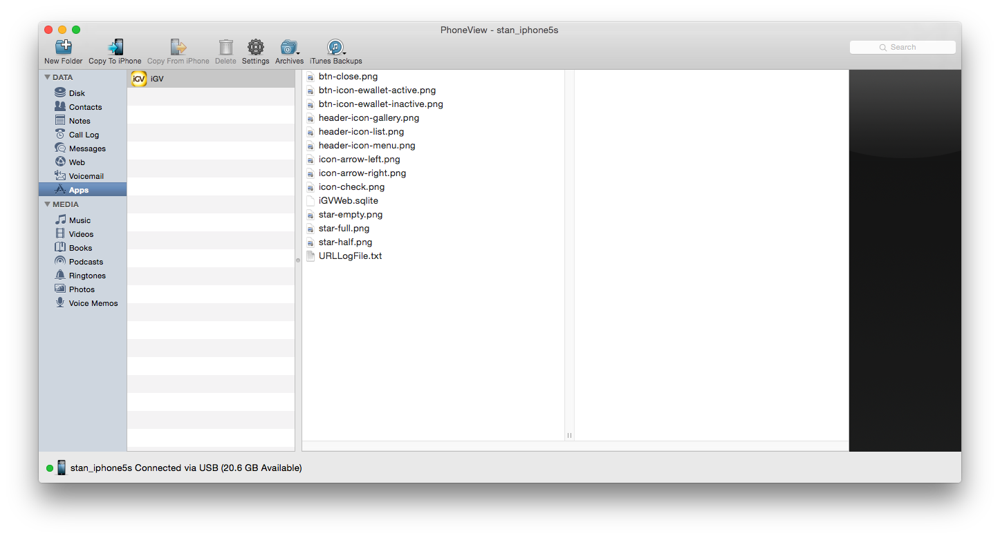
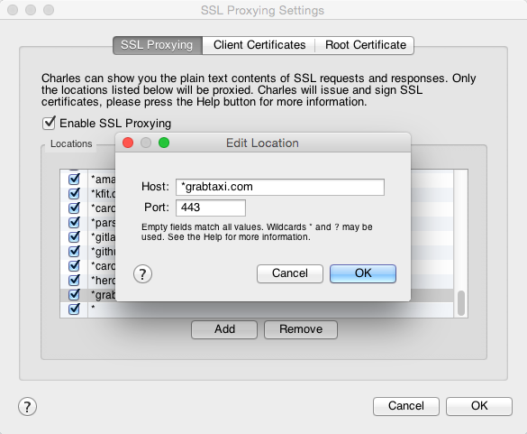
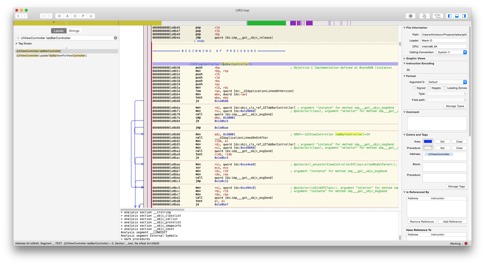

# [fit] Inspecting 3rd Party Apps

---

# [fit] I'm Stan!
## A.K.A @**lx**cid

---

# **Disclaimer**
### For education purpose only

^More of a Show & Tell session

---

# Attack Surface

---

# **App Content**
## Extraction

---

# App Content Extraction

- Download App using iTunes.
- Right Click on the App and Select Show in Finder.
- Rename the `.ipa` File to `.zip` File.
- Extracts the Zip File.
- Find the App Package in `Payload` Directory.
- Right Click on the App and Select Show Package Contents.

---

# **App Content**
## Extraction
### *Grab*

---

## **App Documents**
### Extraction

---

## **App Documents**
### Extraction
#### *Only works before iOS 8.3*

---

## App Documents Extraction 

PhoneView, iExplorer, etc…
**DANGER: TRUST NO COMPUTER!!!**

---

## **Network/API**
### Analysis

---

# Network/API Analysis

### **MotM with Charles Proxy: charlesproxy.com**

- Ensure your Computer and Phone are connected to the same Wi-Fi network.
- Access the Connected Wi-Fi Settings under Settings > Wi-Fi > *Connected Wi-Fi Network Name*
- Set HTTP Proxy to Manual, Server and Port point to Charles Proxy. 

---

# SSL

Install Root Certificate. *Danger: You must know what you doing*

---

# SSL

Go to Menu > Proxy > SSL Proxy Settings…

---

## SSL Pinning
### **Uh-oh**

---

# Jailbreak
#### reddit.com/r/jailbreak
#### 9.0, 9.1, **~~9.2~~**

---

# Lots of great content out the net

- [Realm.io: Reverse-Engineering iOS Apps: Hacking on Lyft](https://realm.io/news/conrad-kramer-reverse-engineering-ios-apps-lyft/)
- [JailbreakCon 2013 - Adam Bell](https://www.youtube.com/watch?v=Ox09rWJTuCA)
- [Peter Steinberger: How to Inspect the View Hierarchy of Third-Party Apps](http://petersteinberger.com/blog/2013/how-to-inspect-the-view-hierarchy-of-3rd-party-apps/)
- [iPhoneDevWiki: Reverse Engineering Tools](http://iphonedevwiki.net/index.php/Reverse_Engineering_Tools)

---

## **DETOUR**
### App Documents Extraction
#### */w SSH*
#### *Data: /private/var/mobile/Containers/Data/{uuid}*
#### *App Group: /private/var/mobile/Containers/Shared/AppGroup/{uuid}*

^Grab: 5EDF3079-4AAC-4831-A711-29606A30AE0A

---

## **View Hierarchy**
### Inspection

---

# View Hierarchy Inspection /w Reveal

http://revealapp.com  
https://github.com/heardrwt/RevealLoader

---

# View Hierarchy Inspection /w Flex

https://github.com/Flipboard/FLEX  
https://github.com/qiaoxueshi/FLEXLoader

---

## **DETOUR**
### Breaking SSL Pinning

^ Show how to break SSL Pinning on Carousell

---

## **Code**
### Inspection
#### *Hopper or IDA Pro*

---

# Code Inspection /w Hopper

---

## **Apps from iTunes**
### are encrypted

---

## Dumpdecrypt

#####`DYLD_INSERT_LIBRARIES=dumpdecrypted.dylib /var/mobile/Containers/Bundle/Application/*/GrabTaxi.app/GrabTaxi`

https://github.com/stefanesser/dumpdecrypted

---

## **Code**
### Injection
#### *Cycript*

---

# Inspired by…

- [Singapore taxis](http://uzyn.github.io/taxisg/)
- [FOSS Asia 2016: Uncovering of an obfuscated public governmental API](https://speakerdeck.com/uzyn/uncovering-of-an-obfuscated-public-governmental-api-foss-asia-2016)

---

## **Case Study**
#### Cracking Taxi-Taxi@SG's password

---

# More we have not talked about…

- LLDB
- Class Dump
- Tweaks

---

### Thank You!